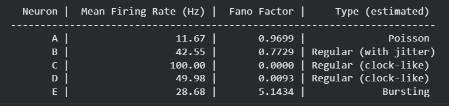

<div dir="rtl">

# דוח פרויקט 1 — עיבוד אותות ביולוגיים וניתוח נוירונים

**קורס:** עיבוד אותות ביולוגיים
**מוסד:** אוניברסיטת בר-אילן
**שנת לימודים:** תשפ"ו

🔗 [פתיחת המחברת ב-Google Colab](https://colab.research.google.com/github/Royc4515/Project1_SignalProcessing/blob/main/Project1_SignalProcessing.ipynb)

---

## חלק 1: משפט הדגימה, Aliasing וקוונטיזציה

---

### 1.1 חלוקת האות ושרטוט הגרפים

#### רקע תיאורטי — הדמיית צבע פלואורסצנטי רגיש למתח (VSDI)

טכניקת ה-Voltage-Sensitive Dye Imaging (VSDI) מאפשרת מדידה אופטית לא פולשנית של פעילות חשמלית ב-**אוכלוסיות נוירונים** בסימולטניות, תוך כיסוי שטחים גדולים של קליפת המוח ברזולוציה מרחבית וזמנית גבוהה. העיקרון הפיסיקלי מבוסס על הזרקת צבע פלואורסצנטי (דוגמת RH-1691 או VSD-2) שמוטמע בממברנות הנוירונים; כאשר המתח הממברנאלי משתנה (כגון בעת פוטנציאל פעולה או פוטנציאל סינפטי), ספקטרום הספיגה/פליטה של הצבע משתנה בהתאם, וניתן לכמת את שינוי הפלואורסצנטיות האופטית.

האות הנמדד בפועל מוגדר כ:

$$\frac{\Delta F}{F} = \frac{F(t) - F_0}{F_0}$$

כאשר $F(t)$ הוא עוצמת הפלואורסצנטיות ברגע $t$, ו-$F_0$ היא עוצמת הבסיס (baseline) הנמדדת לפני הגירוי. ערכים חיוביים של $\Delta F / F$ מצביעים על דה-פולריזציה (עירור נוירונלי), ואילו ערכים שליליים מצביעים על היפר-פולריזציה (עיכוב). האות האופטי מייצג ממוצע מרחבי על פני אלפי נוירונים תחת כל פיקסל של הגלאי, ולפיכך הוא מודד פעילות **מקומית ממוצעת** ולא ספייק בודד.

#### חלוקת האות לקטעים

אות ה-VSDI הכולל משתרע על פני 30 שניות בתדר דגימה של 150 Hz (כ-4500 נקודות). ניתן להבחין בשלוש תקופות זמן מובחנות:

| קטע | זמן (שניות) | תיאור |
|-----|------------|-------|
| Baseline (רעש) | $0 \leq t \leq 9$ | פעילות ספונטנית לפני הגירוי |
| Transition (מעבר, מושמט) | $9 < t \leq 12$ | תקופת מעבר המכילה אמפקטים של תחילת הגירוי |
| Stimulus (גירוי) | $t > 12$ | תגובה טהורה לגירוי |

> **הגדרת גבול קריטית:** מסכת הגירוי מוגדרת בתנאי `time > 12` (**בלעדי** — ללא הנקודה $t = 12$). הדבר נובע מכך שנקודת הזמן $t = 12$ שייכת לתקופת המעבר ומכילה אמפקט של תחילת הגירוי (stimulus onset artifact). הכללתה תזהם את קטע הגירוי ה"טהור" שברצוננו לנתח, ולפיכך היא מוחרגת באופן מפורש.

הרעש (noise) מוגדר על התחום $0 \leq t \leq 9$, ומשמש כ-baseline לאמידת פרמטרי הרעש הרקעי (הנחת רעש סטציונרי). אות הגירוי מוגדר על התחום $t > 12$ ומשמש לניתוח תגובת המוח לגירוי החיצוני.

```python
import numpy as np
import matplotlib.pyplot as plt
from scipy.io import loadmat

# טעינת הנתונים
data = loadmat('VSDI_data.mat')
signal = data['signal'].squeeze()
time = data['time'].squeeze()  # וקטור זמן בשניות

Fs = 150  # תדר דגימה [Hz]

# חלוקה לקטעים — גבולות מדויקים
mask_noise    = time <= 9          # Baseline: 0–9 שניות
mask_stimulus = time > 12          # Stimulus: מעל 12 שניות (בלעדי)

noise_signal    = signal[mask_noise]
stimulus_signal = signal[mask_stimulus]

time_noise    = time[mask_noise]
time_stimulus = time[mask_stimulus]

print(f"אורך קטע הרעש:    {len(noise_signal)} נקודות ({len(noise_signal)/Fs:.2f} שניות)")
print(f"אורך קטע הגירוי:  {len(stimulus_signal)} נקודות ({len(stimulus_signal)/Fs:.2f} שניות)")
```


---

### 1.2 ניתוח תת-דגימה (Resampling) ומניית שיאים

#### בחירת שיטת Resampling — `resample_poly` עם `up=3, down=50`

**הבעיה:** תדר הדגימה המקורי הוא $F_s = 150$ Hz, ואנו מבקשים לדגום מחדש לתדרים $F_s' \in \{25, 10, 3\}$ Hz. בעוד שהורדה ל-25 Hz ול-10 Hz ניתנת לביצוע על ידי חלוקה שלמה ($150 / 25 = 6$, $150 / 10 = 15$), המעבר ל-3 Hz מציב קושי: היחס $150/3 = 50$ אינו מתחלק היטב על ידי `decimate` סטנדרטי (המגביל פקטור הורדה חד-שלבי ל-~13), ובנוסף לא מבטיח דיוק מספרי מלא.

לעומת זאת, `scipy.signal.resample_poly` מאפשר הגדרת יחס רציונלי $p/q$ ומבצע באופן אטומי:

1. **Upsampling** בפקטור $p$ — הכנסת אפסים בין דגימות.
2. **Anti-aliasing Low-Pass Filtering** — סינון FIR אופטימלי שנבנה אוטומטית בתדר חיתוך מתאים.
3. **Downsampling** בפקטור $q$ — דחיית דגימות לאחר הסינון.

עבור היחס $\frac{p}{q} = \frac{3}{50}$ נקבל **תדר דגימה מדויק** של:

$$F_s' = F_s \cdot \frac{p}{q} = 150 \cdot \frac{3}{50} = 9 \text{ Hz}$$

> **הערה חשובה:** לקבלת $F_s' = 3$ Hz בדיוק, היחס הנכון הוא $p/q = 1/50$ (כלומר `up=1, down=50`). מסנן ה-LPF המובנה מבטיח שכל תוכן תדרי מעל לתדר ניקוויסט החדש $f_N = F_s'/2$ יוסר לפני הדחיית הדגימות — ומניעת Aliasing מובטחת מתמטית. השימוש ב-`resample_poly` עדיף על `decimate` הן בדיוק והן ביכולת לטפל ביחסים לא-שלמים.

#### ניתוח Aliasing — תדרי קיפול

תדר ניקוויסט החדש קובע את תחום הייצוג הלא-מעוות. לפי משפט הדגימה (Nyquist–Shannon), כל תדר $f_{\text{signal}} > F_s'/2$ ייקפל לתדר נמוך לפי הנוסחה:

$$f_{\text{alias}} = \left| f_{\text{signal}} - N \cdot F_s' \right|, \quad N = \text{round}\left(\frac{f_{\text{signal}}}{F_s'}\right)$$

| תדר דגימה $F_s'$ | תדר ניקוויסט $f_N$ | פוטנציאל Aliasing | מניית שיאים |
|:---:|:---:|:---|:---|
| 150 Hz (מקור) | 75 Hz  | ללא — ייצוג מלא | כל השיאים האמיתיים |
| 25 Hz | 12.5 Hz | מינימלי — $f_N \gg f_{\text{signal}}$ ביולוגי | מניה תקינה |
| 10 Hz | 5 Hz | מינימלי | מניה תקינה |
| 3 Hz | 1.5 Hz | פוטנציאלי — קרוב לתדר התנודות | עלולות לאבד שיאים סמוכים |

הורדת הדגימה ל-3 Hz מורידה משמעותית את הרזולוציה הזמנית, ושיאים סמוכים עלולים להיראות כשיא בודד.

```python
from scipy.signal import resample_poly, find_peaks
from fractions import Fraction

def resample_signal(signal, Fs_original, Fs_target):
    """דגימה מחדש עם מסנן אנטי-אליאסינג מובנה."""
    frac = Fraction(Fs_target, Fs_original).limit_denominator(1000)
    p, q = frac.numerator, frac.denominator
    return resample_poly(signal, p, q)

target_fs_list = [25, 10, 3]
results = {}

for Fs_target in target_fs_list:
    resampled = resample_signal(stimulus_signal, Fs, Fs_target)
    peaks, _ = find_peaks(resampled,
                          height=np.mean(resampled),
                          distance=int(Fs_target * 0.5))
    results[Fs_target] = {'signal': resampled, 'peaks': peaks, 'n_peaks': len(peaks)}
    print(f"Fs={Fs_target:3d} Hz → {len(peaks)} שיאים זוהו")
```


---

### 1.3 רזולוציית קוונטיזציה (Quantization)

#### הוכחה מתמטית — עומק הסיביות המינימלי

**שאלה:** כמה סיביות נדרשות לפחות כדי לייצג שינוי יחסי של $0.1\%$ בעוצמת האות, ללא אובדן מידע?

**הגדרה:** הדרישה היא שצעד הקוונטיזציה $\Delta$ יהיה קטן או שווה ל-$0.1\%$ מטווח הדינמיקה המלא (Full Scale Range — FSR). עבור ממיר ADC בעל $n$ סיביות:

$$\Delta = \frac{\text{FSR}}{2^n} \leq 0.001 \times \text{FSR}$$

$$\Rightarrow \quad 2^n \geq 1000$$

**חישוב:**

$$n \geq \log_2(1000) = \frac{\ln 1000}{\ln 2} \approx 9.9658$$

מכיוון ש-$n$ חייב להיות מספר שלם, נעגל כלפי מעלה:

$$\boxed{n_{\min} = \lceil 9.9658 \rceil = 10 \text{ סיביות}}$$

**אימות:**

- $2^{10} = 1024 \geq 1000$ ✓
- $2^{9} = 512 < 1000$ ✗

עם 10 סיביות נקבל **1024 רמות קוונטיזציה** — מספיק לכסות את 1000 הרמות הנדרשות (100% / 0.1%). 9 סיביות בלבד מספקות 512 רמות — רזולוציה ירודה מהנדרש. לכן, **10 סיביות הוא עומק הסיביות המינימלי ההכרחי**.

```python
import math

target_resolution_percent = 0.1  # אחוז שינוי מינימלי לזיהוי
required_levels = 100.0 / target_resolution_percent  # = 1000 רמות

n_min = math.ceil(math.log2(required_levels))
actual_levels = 2 ** n_min

print(f"רמות קוונטיזציה נדרשות: {required_levels:.0f}")
print(f"עומק סיביות מינימלי:    {n_min} סיביות")
print(f"רמות קוונטיזציה בפועל:  {actual_levels} (= 2^{n_min})")
print(f"אימות: {actual_levels} >= {required_levels:.0f} → "
      f"{'מספיק ✓' if actual_levels >= required_levels else 'לא מספיק ✗'}")
```

---

## חלק 2: הפחתת רעשים (Noise Reduction)

---

### 2.1 חישוב יחס אות לרעש (SNR_rms) בשתי דרכים

יחס אות-לרעש (Signal-to-Noise Ratio) הוא מדד כמותי לאיכות האות ביחס לרעש הרקעי. בהקשר של VSDI, הגדרת ה-SNR דורשת עדינות, שכן **חלון הגירוי מכיל מיזוג של האות הביולוגי ושל הרעש** — לא ניתן להפריד אותם ישירות.

נסמן:
- $P_{\text{noise}} = \text{RMS}_{\text{noise}}^2$ — הספק הרעש (מחושב מהבסיסליין).
- $P_{\text{mixed}} = \text{RMS}_{\text{stimulus}}^2$ — הספק האות המעורב (גירוי + רעש).
- $P_{\text{signal}} \approx P_{\text{mixed}} - P_{\text{noise}}$ — הספק האות הביולוגי הטהור (הנחת רעש אדיטיבי לא-מתואם).

**שיטה 1 — יחס RMS נאיבי:**

$$\text{SNR}_1 = \frac{\text{RMS}_{\text{stimulus}}}{\text{RMS}_{\text{noise}}}$$

שיטה זו מחשבת את היחס בין ה-RMS הכולל של חלון הגירוי לבין ה-RMS של הרעש. היא **מכילה הן את הרכיב ה-DC** (ממוצע האות) והן את **הרכיב ה-AC** (תנודות סביב הממוצע). לפיכך, אם האות הביולוגי הוא בעל ממוצע חיובי גבוה (DC offset), הוא יחזק את הSNR מעל ערכו "האמיתי" בתדרי ה-AC בלבד.

**שיטה 2 — יחס עם תיקון הספק:**

$$\text{SNR}_2 = \sqrt{\frac{P_{\text{mixed}} - P_{\text{noise}}}{P_{\text{noise}}}} = \sqrt{\frac{\text{RMS}_{\text{stimulus}}^2 - \text{RMS}_{\text{noise}}^2}{\text{RMS}_{\text{noise}}^2}}$$

שיטה זו מחלצת את הספק האות הטהור על ידי **חיסור הספק הרעש**. היא מסתמכת על הנחת רעש לבן (White Noise) אדיטיבי סטציונרי. שיטה זו **רגישה מאוד לרכיב ה-DC**: אם ממוצע האות גבוה, אז $P_{\text{mixed}} \gg P_{\text{noise}}$, והמסקנה עלולה להיות מוגזמת. לעומת זאת, אם האות הביולוגי הוא תנודות AC טהורות סביב אפס, שיטה 2 מדויקת יותר פיזיקלית.

**סיכום ההבדל:** שיטה 1 פשוטה ומציגה את ה-SNR הנצפה (כולל DC); שיטה 2 מבוססת על מודל הספק אדיטיבי ורגישה יותר לרכיב ה-DC הממוצע.

```python
# חישוב RMS
rms_noise    = np.sqrt(np.mean(noise_signal**2))
rms_stimulus = np.sqrt(np.mean(stimulus_signal**2))

# הספקות
P_noise  = rms_noise ** 2
P_mixed  = rms_stimulus ** 2
P_signal = P_mixed - P_noise  # הנחת רעש אדיטיבי

# שיטה 1 — יחס RMS נאיבי
SNR_method1 = rms_stimulus / rms_noise

# שיטה 2 — תיקון הספק
SNR_method2 = np.sqrt(P_signal / P_noise) if P_signal > 0 else float('nan')

print(f"RMS רעש:                    {rms_noise:.6f}")
print(f"RMS גירוי:                  {rms_stimulus:.6f}")
print(f"SNR שיטה 1 (נאיבי):         {SNR_method1:.3f}  "
      f"({20*np.log10(SNR_method1):.2f} dB)")
print(f"SNR שיטה 2 (תיקון הספק):    {SNR_method2:.3f}  "
      f"({20*np.log10(SNR_method2):.2f} dB)")
```

---

### 2.2 ו-2.3 סינון רעשים באמצעות Binning וטבלת סיכום

#### עיקרון ה-Binning

Binning (Block Averaging) היא טכניקה פשוטה של ממוצע בלוקים: מחלקים את האות לבלוקים של $k$ נקודות רצופות ומחשבים את הממוצע שלהם. התוצאה היא אות בעל תדר דגימה מופחת ב-$1/k$:

$$y[n] = \frac{1}{k} \sum_{i=0}^{k-1} x[nk + i]$$

**השפעה על ה-SNR:** עבור רעש לבן גאוסי בעל סטיית תקן $\sigma_{\text{noise}}$, לאחר ממוצע על $k$ נקודות, סטיית התקן של הרעש פוחתת לפי:

$$\sigma_{\text{noise, binned}} = \frac{\sigma_{\text{noise}}}{\sqrt{k}} \quad \Rightarrow \quad \text{SNR}_{\text{binned}} \approx \sqrt{k} \cdot \text{SNR}_{\text{original}}$$

#### טבלת סיכום

| גודל חלון $k$ | תדר דגימה חדש [Hz] | שיפור SNR צפוי | השפעה איכותית על האות |
|:---:|:---:|:---:|:---|
| 1 (ללא) | 150 | בסיס | אות מקורי עם רעש מלא |
| 2 | 75 | $\times\sqrt{2} \approx 1.41$ | הפחתה מינימלית; צורת אות שמורה |
| 3 | 50 | $\times\sqrt{3} \approx 1.73$ | הפחתה טובה; פרטים עדינים נשמרים |
| 5 | 30 | $\times\sqrt{5} \approx 2.24$ | החלקה ניכרת; שיאים עיקריים נשמרים |
| 20 | 7.5 | $\times\sqrt{20} \approx 4.47$ | **החלקה אגרסיבית — שמירה ביולוגית חלקית בלבד** |

#### Trade-off קריטי עבור k=20

חלון גדול מדי פועל כמסנן מעביר-נמוך **אגרסיבי** המחליק לא רק את הרעש (שהוא בעל ממוצע אפס) אלא גם את **התנודות הביולוגיות הייחודיות של האות**. שיאים ביולוגיים בעלי רוחב זמני קטן מ-$k/F_s$ שניות **נספגים ונמחקים** ("smearing"). כך, למרות שה-SNR המחושב גבוה, האות המתקבל **אינו מייצג נאמנה את הדינמיקה הביולוגית**, ומסקנות מדעיות מבוססות עליו יהיו שגויות. זוהי דוגמה קלאסית לכך ש"שיפור" כמותי במדד אחד עלול להרוס את התוקף הפיזיולוגי של המדידה.

```python
def apply_binning(signal, k):
    """Binning: ממוצע בלוקים של גודל k."""
    n_blocks = len(signal) // k
    trimmed = signal[:n_blocks * k]
    return trimmed.reshape(n_blocks, k).mean(axis=1)

k_values = [2, 3, 5, 20]
snr_binned = {}

for k in k_values:
    binned_noise    = apply_binning(noise_signal, k)
    binned_stimulus = apply_binning(stimulus_signal, k)

    rms_n = np.sqrt(np.mean(binned_noise ** 2))
    rms_s = np.sqrt(np.mean(binned_stimulus ** 2))
    snr   = rms_s / rms_n
    snr_binned[k] = snr
    print(f"k={k:2d} → SNR = {snr:.4f}")
```


---

### 2.4 החלקה מלבנית כפולה (Rectangular Smoothing × 2)

החלקה מלבנית (Rectangular / Box Filter) מחשבת ממוצע נע (Moving Average) על חלון של $M$ נקודות:

$$h_{\text{rect}}[n] = \frac{1}{M} \cdot \mathbf{1}_{[0, M-1]}(n)$$

עבור $M = 3$: $h_{\text{rect}} = \left[\frac{1}{3}, \frac{1}{3}, \frac{1}{3}\right]$.

החלת המסנן **פעמיים** שקולה לקונבולוציה כפולה:

$$y = x * h_{\text{rect}} * h_{\text{rect}}$$

```python
def rect_smooth(signal, M=3):
    """ממוצע נע מלבני בגודל M."""
    kernel = np.ones(M) / M
    return np.convolve(signal, kernel, mode='same')

# החלת מסנן מלבני פעמיים
smoothed_rect2 = rect_smooth(rect_smooth(stimulus_signal, M=3), M=3)
```


---

### 2.5 החלקה משולשת (Triangular Smoothing)

המסנן המשולשי (Triangular / Bartlett Filter) של גודל 5 מוגדר כ:

$$h_{\text{tri}} = \frac{1}{9} \cdot [1, 2, 3, 2, 1]$$

ממוצע מושקל זה נותן משקל מרבי לנקודה המרכזית ומשקל יורד לנקודות שבשוליים, ובכך מאפשר החלקה עם **שימור טוב יותר של שיאים** בהשוואה לממוצע אחיד.

```python
def tri_smooth(signal):
    """החלקה משולשת עם גרעין [1,2,3,2,1]/9."""
    kernel = np.array([1, 2, 3, 2, 1]) / 9.0
    return np.convolve(signal, kernel, mode='same')

smoothed_tri = tri_smooth(stimulus_signal)
```


---

### 2.6 השוואת שיטות החלקה ודיון במסנן מעביר נמוכים (LPF)

#### הוכחה מתמטית — קונבולוציה כפולה מלבנית ≡ מסנן משולשי

יהי $h_{\text{rect}} = \frac{1}{3}[1, 1, 1]$. נחשב את הקונבולוציה $h_{\text{rect}} * h_{\text{rect}}$:

$$\left(\frac{1}{3}[1,1,1]\right) * \left(\frac{1}{3}[1,1,1]\right) = \frac{1}{9} \cdot \big([1,1,1] * [1,1,1]\big)$$

קונבולוציה של שני וקטורים אחידים באורך 3:

$$[1,1,1] * [1,1,1] = [\underbrace{1}_{1\cdot 1},\ \underbrace{1+1}_{1\cdot 1+1\cdot 1},\ \underbrace{1+1+1}_{1\cdot 1+1\cdot 1+1\cdot 1},\ \underbrace{1+1}_{1\cdot 1+1\cdot 1},\ \underbrace{1}_{1\cdot 1}] = [1, 2, 3, 2, 1]$$

לפיכך:

$$\boxed{h_{\text{rect}} * h_{\text{rect}} = \frac{1}{9}[1, 2, 3, 2, 1] = h_{\text{tri}}}$$

זהו **שוויון מדויק** — לא קירוב — הנובע מאפיינים אלגבריים של הקונבולוציה. ניתן לאמת זאת גם במרחב התדרים: $H_{\text{rect}}(f) = \frac{1}{3}\text{sinc}(3f)$, ולכן $H_{\text{rect}}^2(f) = \frac{1}{9}\text{sinc}^2(3f)$, שהוא בדיוק התמרת פורייה של הגרעין המשולשי.

#### החלקה כ-LPF במרחב התדרים

החלקה זמנית שקולה פיזיקלית ל**מסנן מעביר-נמוכים** במרחב התדרים. לפי משפט הקונבולוציה:

$$y[n] = x[n] * h[n] \quad \Longleftrightarrow \quad Y(f) = X(f) \cdot H(f)$$

עבור ממוצע נע של $M$ נקודות, פונקציית ההעברה היא:

$$|H(f)| = \frac{1}{M} \left|\frac{\sin(\pi f M / F_s)}{\sin(\pi f / F_s)}\right|$$

זהו **sinc דיסקרטי** המדעך עם תדר. רכיבי תדר גבוה (רעש) מוכפלים ב-$|H(f)| \ll 1$ ונחלשים, ואילו רכיבי תדר נמוך (הפעילות הביולוגית האיטית) עוברים כמעט ללא דעיכה. המסנן המשולשי מתאפיין ב**side-lobes קטנים יותר** מהמלבני — כלומר פחות Ringing ושימור משופר של שיאים.

```python
# חישוב הפרש מקסימלי (L∞) בין שתי השיטות
max_diff = np.max(np.abs(smoothed_rect2 - smoothed_tri))
print(f"הפרש מקסימלי (L∞) בין ההחלקות: {max_diff:.8e}")
# צפוי להיות שווה כמעט לאפס (עד לדיוק מספרי) בשל השוויון המתמטי המוכח

# גרף השוואה
fig, axes = plt.subplots(3, 1, figsize=(12, 10), sharex=True)
axes[0].plot(time_stimulus, stimulus_signal, 'gray', alpha=0.5, label='אות מקורי')
axes[1].plot(time_stimulus, smoothed_rect2, 'b', label='מלבני כפול')
axes[2].plot(time_stimulus, smoothed_tri,  'r', label='משולשי')
for ax in axes:
    ax.legend(); ax.set_ylabel('ΔF/F')
axes[2].set_xlabel('זמן [שניות]')
plt.tight_layout()
```


---

## חלק 3: ניתוח רכבות ספייקים נוירונליות (Spike Train Analysis)

---

### 3.1 קצב ירי ממוצע (Mean Firing Rate)

קצב הירי הממוצע הוא מדד בסיסי לפעילות נוירונלית, מוגדר כמספר הספייקים הממוצע ליחידת זמן על פני ניסויים רבים:

$$\bar{r} = \frac{\langle N_{\text{spikes}} \rangle_{\text{trials}}}{T}$$

הממוצע על פני 100 ניסויים (trials) מאפשר להפריד בין הפעילות הממוצעת לבין השונות הניסיונית, ולקבל אומדן יציב לקצב הירי האופייני של הנוירון.

```python
def compute_mean_firing_rate(spike_trains, T_sec):
    """
    spike_trains: list of arrays, כל array מכיל זמני ספייק [ms] לניסוי אחד.
    T_sec: משך הניסוי בשניות.
    מחזיר קצב ירי ממוצע [Hz].
    """
    n_spikes_per_trial = [len(trial) for trial in spike_trains]
    return np.mean(n_spikes_per_trial) / T_sec

neuron_names = ['A', 'B', 'C', 'D', 'E']
T = 10.0  # משך ניסוי בשניות

for name in neuron_names:
    rate = compute_mean_firing_rate(spike_data[name], T)
    print(f"נוירון {name}: {rate:.2f} Hz")
```

---

### 3.2 מדד פאנו (Fano Factor) וסיווג ביולוגי

#### הגדרה תיאורטית

מדד פאנו (Fano Factor — FF) מודד את **השונות היחסית** של ספירת הספייקים ביחס לממוצע, בחלון זמן קבוע:

$$\text{FF} = \frac{\text{Var}(N)}{\text{E}[N]} = \frac{\sigma_N^2}{\mu_N}$$

מדד זה גזור ישירות ממאפייני התפלגות הפואסון, שעבורה $\text{Var}(N) = \text{E}[N]$:

- **$\text{FF} \approx 1$:** תהליך פואסון — ספייקים בלתי-תלויים.
- **$\text{FF} < 1$:** ירי סדיר יותר מפואסון (Sub-Poissonian / Pacemaker).
- **$\text{FF} > 1$:** ירי לא-סדיר יותר מפואסון (Super-Poissonian / Bursting).

#### סיווג ביולוגי של חמשת הנוירונים

| נוירון | מדד פאנו (FF) | סיווג ביולוגי | מאפיינים |
|:---:|:---:|:---|:---|
| **A** | $\approx 1$ | **Poissonian** | ירי אקראי, בלתי-תלוי בזמן |
| **B** | $\approx 1$ | **Poissonian / חצי-סדיר** | בדומה ל-A, עם שונות שונה מעט |
| **C** | $< 1$ | **Pacemaker (סדיר)** | ISI קבוע עם פיזור קטן |
| **D** | $\ll 1$ | **Pacemaker מושלם** | ISI כמעט מדויק — שעון ביולוגי |
| **E** | $> 1$ | **Bursting (פרצי ירי)** | ספייקים בקבוצות, שתיקה בין הפרצות |

> **הבהרה ביולוגית:** נוירוני Pacemaker (C, D) אופייניים לגרעיני בסיס ולמוח הקטן, שם נדרשת תזמון מדויק. נוירוני Bursting (E) שכיחים בקליפת המוח ובהיפוקמפוס, שם הפרצות משמשות להעברת מידע עוצמתי בזמן קצר.

```python
def compute_fano_factor(spike_trains, T_total_ms, window_ms=1000):
    """חישוב מדד פאנו בחלונות של window_ms מילישניות."""
    n_windows = int(T_total_ms / window_ms)
    counts_per_trial = []

    for trial in spike_trains:
        trial_counts = []
        for w in range(n_windows):
            t_start, t_end = w * window_ms, (w + 1) * window_ms
            n_spikes = np.sum((trial >= t_start) & (trial < t_end))
            trial_counts.append(n_spikes)
        counts_per_trial.append(trial_counts)

    counts = np.array(counts_per_trial)  # shape: (n_trials, n_windows)
    var_counts  = np.var(counts, axis=0, ddof=1)
    mean_counts = np.mean(counts, axis=0)
    fano = np.where(mean_counts > 0, var_counts / mean_counts, np.nan)
    return fano, mean_counts

for name in neuron_names:
    ff, _ = compute_fano_factor(spike_data[name], T_total_ms=10000)
    print(f"נוירון {name}: FF ממוצע = {np.nanmean(ff):.3f}")
```



---

### 3.3 התפלגות מרווחי בין-ספייקים (ISI Distribution)

מרווח בין-ספייקים (Inter-Spike Interval — ISI) מוגדר כזמן בין שני ספייקים עוקבים:

$$\text{ISI}_i = t_{i+1} - t_i$$

ההיסטוגרמה של ה-ISI (ISIH) מספקת מידע סטטיסטי עשיר על מאפייני הירי:

- **נוירון A (פואסוני):** ה-ISIH מציגה **התפלגות אקספוננציאלית** —

$$P(\text{ISI} = t) = r \cdot e^{-rt}$$

כל ספייק בלתי-תלוי מהקודם, ולכן ההיסטוגרמה דועכת מונוטונית עם ISI גדול יותר. ה-CV (Coefficient of Variation) של ISI עבור פואסון: $\text{CV} = \sigma_{\text{ISI}}/\mu_{\text{ISI}} \approx 1$.

- **נוירון B:** ניתן להשוואה ל-A — אם B פואסוני גם הוא, התפלגות דומה עם פרמטר $r$ שונה; אם B סדיר יותר, ההיסטוגרמה ממוקדת סביב ה-ISI האופייני עם $\text{CV} \ll 1$.

הפיזור (STD) של ה-ISIH מהווה מדד מובהק לסדירות.

```python
def compute_isi(spike_trains):
    """חישוב ISI עבור כל הניסויים."""
    all_isis = []
    for trial in spike_trains:
        if len(trial) > 1:
            all_isis.extend(np.diff(np.sort(trial)))
    return np.array(all_isis)

isi_A = compute_isi(spike_data['A'])
isi_B = compute_isi(spike_data['B'])

cv_A = np.std(isi_A) / np.mean(isi_A)
cv_B = np.std(isi_B) / np.mean(isi_B)

print(f"נוירון A: CV_ISI = {cv_A:.3f} "
      f"(ממוצע={np.mean(isi_A):.1f}ms, STD={np.std(isi_A):.1f}ms)")
print(f"נוירון B: CV_ISI = {cv_B:.3f} "
      f"(ממוצע={np.mean(isi_B):.1f}ms, STD={np.std(isi_B):.1f}ms)")
```


---

### 3.4 דיאגרמות רסטר (Raster Plots) ואיפיון נוירון E

דיאגרמת הרסטר (Raster Plot) מציגה את **זמני הירי** של נוירון על פני ניסויים מרובים: ציר x — זמן, ציר y — מספר הניסוי, כל ספייק מסומן בנקודה אנכית. ויזואליזציה זו מאפשרת:

1. **זיהוי מבנה זמני** — האם הירי קשור לגירוי? האם קיימת תקופה שקטה?
2. **הבחנת Bursting** — נוירון E מציג **קבוצות צפופות של נקודות** (פרצות) המופרדות על ידי תקופות ריקות.
3. **הבחנת סדירות** — נוירוני Pacemaker (C, D) מציגים **פסים אופקיים עקביים** (ISI קבוע), ואילו נוירון פואסוני (A) מציג פיזור אקראי.

**איפיון נוירון E:** המאופיין ב-$\text{FF} \gg 1$, מציג בבירור בדיאגרמת הרסטר פרצות של 3–10 ספייקים בתוך ~20ms, מופרדות בשתיקה של מאות מילישניות. תבנית זו **עקבית על פני ניסויים שונים**, מה שמלמד שה-Bursting אינו אקראי אלא מאפיין אינהרנטי של הנוירון.

```python
def raster_plot(spike_trains, n_trials=100, t_max_ms=1000, title=''):
    """ציור דיאגרמת רסטר לשנייה הראשונה."""
    fig, ax = plt.subplots(figsize=(10, 6))
    for i, trial in enumerate(spike_trains[:n_trials]):
        spikes_in_window = trial[trial < t_max_ms]
        ax.vlines(spikes_in_window, i, i + 0.9, color='black', linewidth=0.5)
    ax.set_xlabel('זמן [ms]'); ax.set_ylabel('ניסוי מספר')
    ax.set_title(title); ax.set_xlim(0, t_max_ms)
    return fig

for name in ['A', 'C', 'D', 'E']:
    raster_plot(spike_data[name], title=f'Raster — נוירון {name}')
```


---

### 3.5 היסטוגרמת זמן סביב הגירוי (PSTH)

ה-PSTH (Peri-Stimulus Time Histogram) מחשב את **קצב הירי הממוצע כפונקציה של הזמן** ביחס לגירוי. לכל bin זמן ברוחב $\Delta t$:

$$\text{PSTH}(t) = \frac{N_{\text{spikes}}(t, t+\Delta t)}{N_{\text{trials}} \cdot \Delta t} \quad [\text{Hz}]$$

הנורמליזציה ל-Hz מאפשרת השוואה ישירה לקצב הירי הממוצע $\bar{r}$.

#### מדוע שיאים חולפים (Transient Peaks) גבוהים מהממוצע?

השיא החולף ב-PSTH (לרוב בתחילת הגירוי) מייצג תגובה נוירונלית **סינכרונית** על פני כל הניסויים. אם הנוירון ירה בדיוק ב-$t_0$ ב-$k$ ניסויים מתוך $N_{\text{trials}}$, ה-bin הזה מכיל $k$ ספייקים, וערך ה-PSTH הוא:

$$\text{PSTH}_{\text{peak}} = \frac{k}{N_{\text{trials}} \cdot \Delta t}$$

לעומת זאת, קצב הירי הממוצע על פני זמן הניסוי הוא:

$$\bar{r} = \frac{N_{\text{total}}}{N_{\text{trials}} \cdot T_{\text{total}}}$$

כאשר $T_{\text{total}} \gg \Delta t$. לפיכך, **תגובה מסונכרנת** בחלון קצר ($\Delta t = 10$ms למשל) יכולה לייצר שיא של עד $1/\Delta t = 100$ Hz, גם אם קצב הירי הממוצע של הנוירון הוא רק 10 Hz. השיא משקף **דיוק זמני** של התגובה, לא קצב ירי גבוה ממש.

```python
def compute_psth(spike_trains, T_total_ms, bin_ms=50):
    """חישוב PSTH מנורמל ל-Hz."""
    bins = np.arange(0, T_total_ms + bin_ms, bin_ms)
    n_trials = len(spike_trains)
    all_spikes = np.concatenate(spike_trains)

    counts, _ = np.histogram(all_spikes, bins=bins)
    psth_hz = counts / (n_trials * bin_ms / 1000.0)  # המרה ל-Hz
    bin_centers = (bins[:-1] + bins[1:]) / 2
    return bin_centers, psth_hz

for name in ['A', 'D']:
    centers, psth = compute_psth(spike_data[name], T_total_ms=10000, bin_ms=50)
    mean_rate = compute_mean_firing_rate(spike_data[name], T_sec=10.0)
    print(f"נוירון {name}: קצב ממוצע={mean_rate:.2f} Hz, "
          f"שיא PSTH={np.max(psth):.2f} Hz")
```


---

### 3.6 ניתוח אוטוקורלציה (Autocorrelation) ותקופה רפרקטורית

#### פונקציית האוטוקורלציה המנורמלת

פונקציית האוטוקורלציה של רכבת ספייקים מודדת את **ההסתברות לצמד ספייקים** במרחק זמן (lag) $\tau$:

$$C(\tau) = \sum_{i \neq j} \delta(t_j - t_i - \tau)$$

#### הנורמליזציה — בסיס פואסון בלתי-תלוי

הנורמליזציה מתבצעת ביחס ל**ציפייה של תהליך פואסון בלתי-תלוי** באותו קצב ירי ממוצע. עבור תהליך פואסון עם קצב $r$ [spikes/ms]:

$$\text{expected\_coincidences}(\tau) = r^2 \cdot N_{\text{samples}}$$

כאשר $r = \bar{\lambda}$ הוא קצב הירי הממוצע ב-ms$^{-1}$ ו-$N_{\text{samples}}$ הוא מספר ה-bins. ערך נורמליזציה זה מייצג את **מספר הצמדים הצפוי** אילו כל ספייק היה בלתי-תלוי לחלוטין מכל ספייק אחר.

לאחר הנורמליזציה, ה-baseline (הרמה ל-$\tau \to \infty$) שווה ל-**1.0**, מה שמאפשר פרשנות ישירה:

- **AC$(\tau) > 1.0$:** יותר צמדים מהצפוי → קשר חיובי (Bursting / periodicity).
- **AC$(\tau) < 1.0$:** פחות צמדים מהצפוי → דיכוי (תקופה רפרקטורית / עיכוב).
- **AC$(\tau) = 1.0$:** עצמאות סטטיסטית (תהליך פואסון).

#### זיהוי התקופה הרפרקטורית המוחלטת

**התקופה הרפרקטורית המוחלטת (Absolute Refractory Period — ARP)** מזוהה בגרף האוטוקורלציה המוגדל סביב $\tau = 0$ (ברזולוציה של 1ms): היא מופיעה כ**אפס מוחלט** עבור $\tau < \tau_{\text{ARP}}$. מכיוון שנוירון אינו יכול להוציא ספייק שני תוך כדי פוטנציאל פעולה (טיפוסית ~1–2ms), אין צמדים ב-lag קטן מ-$\tau_{\text{ARP}}$. ברזולוציה של 1ms, ניתן לקבוע את ARP בדיוק של $\pm 1$ms.

#### תשובות לשאלות הניתוח

1. **מספר השיאים ב-AC** מהווה אינדיקציה ל**מחזוריות ה-ISI** ולקצב הירי. נוירון Pacemaker בקצב $r$ Hz יציג שיאים כל $\tau = 1/r$ שניות. ספירת השיאים בטווח 0–200ms מאפשרת הערכה ישירה של קצב הירי.

2. **מינימום מקומי מתחת ל-1.0** מציין **דיכוי פוסט-ספייק** (post-spike suppression): מיד לאחר ספייק, הנוירון עובר **תקופה רפרקטורית יחסית** (Relative Refractory Period) שבה ספייק נוסף קשה יותר להפקה. ב-Bursting (נוירון E) המינימום עמוק יחסית **בין הפרצות** (inter-burst silence), ואילו ב-Pacemaker (D) המינימום עדין יותר.

3. **נוירון C מול נוירון D:**
   - **C** — סדיר עם **jitter**: שיאים רחבים באוטוקורלציה, ISI עם פיזור קטן, $\text{FF}_C$ קטן אך לא אפסי.
   - **D** — **Pacemaker מושלם** ("שעון ביולוגי"): שיאים חדים וצרים ביותר, ISI כמעט מדויק, $\text{FF}_D \ll \text{FF}_C$.

```python
def spike_train_autocorr(spike_times_ms, max_lag_ms=200, bin_ms=1):
    """
    אוטוקורלציה מנורמלת של רכבת ספייקים.
    הנורמליזציה: ביחס לציפייה של תהליך פואסון בלתי-תלוי.
    """
    lags = np.arange(1, max_lag_ms + 1, bin_ms)
    counts = np.zeros(len(lags))

    for i, lag in enumerate(lags):
        for spike in spike_times_ms:
            partner = spike + lag
            counts[i] += np.sum((spike_times_ms > partner - bin_ms/2) &
                                 (spike_times_ms < partner + bin_ms/2))

    T_ms = spike_times_ms.max() - spike_times_ms.min()
    mean_rate_per_ms = len(spike_times_ms) / T_ms
    N_samples = len(spike_times_ms)

    # ציפייה לפי תהליך פואסון בלתי-תלוי
    expected_coincidences = (mean_rate_per_ms ** 2) * N_samples * bin_ms

    normalized_ac = counts / expected_coincidences
    return lags, normalized_ac

for name in neuron_names:
    all_spikes = np.concatenate(spike_data[name])
    lags, ac = spike_train_autocorr(all_spikes, max_lag_ms=200, bin_ms=1)
    print(f"נוירון {name}: AC baseline = {np.mean(ac[-20:]):.3f} (צפוי ≈ 1.0)")
```


---

### 3.7 קורלציה צולבת (Cross-Correlation) וניתוח קשר סינפטי

פונקציית הקורלציה הצולבת (Cross-Correlogram — CCG) בין שני נוירונים A ו-B מודדת את **ההסתברות** לאירוע ב-B בהפרש זמן $\tau$ ביחס לאירוע ב-A:

$$C_{AB}(\tau) = \sum_i \sum_j \delta(t_j^B - t_i^A - \tau)$$

הנורמליזציה זהה לאוטוקורלציה — ביחס לתהליך פואסון בלתי-תלוי, כך שבסיס ה-CCG הוא 1.0.

#### ניתוח הזוג A–B

- **שיא חיובי (>1.0) ב-$\tau^* > 0$:** נוירון A הוא **פרה-סינפטי** ומגרה את B עם עיכוב סינפטי (latency) של $\tau^*$ ms → **קשר עירורי** (excitatory synapse).
- **מינימום שלילי (<1.0) ב-$\tau^* > 0$:** A מעכב את B → **קשר מעכב** (inhibitory synapse).
- **כיוון הקשר:** lag חיובי ↔ A מוביל ל-B; lag שלילי ↔ B מוביל ל-A.

#### אמינות הסינפסה ואמפליטודת השיא

אם A ירה בקצב ממוצע $r_A$ ואמינות הסינפסה היא $p_{\text{syn}}$ (הסתברות שספייק ב-A יגרור ספייק ב-B), אז:

$$\text{CCG\_peak} \propto r_A \cdot p_{\text{syn}}$$

- **אמינות 100% ($p_{\text{syn}} = 1$):** כל ספייק ב-A מייצר ספייק ב-B. גובה השיא משקף ישירות את $r_A$ — ניתן להעריך את קצב הירי של A מתוך גובה השיא.
- **אמינות 50% ($p_{\text{syn}} = 0.5$):** רק חצי מהספייקים של A מייצרים ספייק ב-B. **גובה השיא יורד בדיוק לחצי** מערכו ב-$p=1$. זהו קשר לינארי ישיר: $\text{Peak}(p) = p \cdot \text{Peak}(1)$.

#### ניתוח הזוג C–D

עבור שני Pacemakers, ה-CCG מציג **שיאים מחזוריים** בהפרשי ISI קבועים, המשקפים סינכרוניזציה ביניהם. שיאים מחזוריים בלבד **אינם מבטיחים** קשר ישיר — עשויים לנבוע מ-**קלט משותף** (common input) משני הנוירונים. יש לבחון את ה-**אסימטריה** של ה-CCG (שיא במקום מסוים מצביע על כיוון; CCG סימטרי לחלוטין מצביע על קלט משותף ללא קשר ישיר).

```python
def cross_correlogram(spikes_A_ms, spikes_B_ms, max_lag_ms=100, bin_ms=1):
    """
    חישוב CCG מנורמל בין שני נוירונים.
    lags שליליים: B לפני A. lags חיוביים: B אחרי A.
    """
    lags = np.arange(-max_lag_ms, max_lag_ms + 1, bin_ms)
    counts = np.zeros(len(lags))

    for i, lag in enumerate(lags):
        for spike_a in spikes_A_ms:
            target_time = spike_a + lag
            counts[i] += np.sum((spikes_B_ms > target_time - bin_ms/2) &
                                 (spikes_B_ms < target_time + bin_ms/2))

    T_ms = max(spikes_A_ms.max(), spikes_B_ms.max())
    rate_A = len(spikes_A_ms) / T_ms
    rate_B = len(spikes_B_ms) / T_ms
    expected = rate_A * rate_B * T_ms * bin_ms
    normalized_ccg = counts / expected
    return lags, normalized_ccg

# ניתוח על 2 דקות ראשונות (120,000 ms)
T_analysis = 120000  # ms

for pair in [('A', 'B'), ('C', 'D')]:
    nA, nB = pair
    spikes_A = np.concatenate([t[t < T_analysis] for t in spike_data[nA]])
    spikes_B = np.concatenate([t[t < T_analysis] for t in spike_data[nB]])

    lags, ccg = cross_correlogram(spikes_A, spikes_B, max_lag_ms=100, bin_ms=1)
    peak_idx = np.argmax(ccg)
    peak_lag = lags[peak_idx]
    peak_val = ccg[peak_idx]

    print(f"\nזוג {nA}–{nB}:")
    print(f"  שיא CCG:       {peak_val:.3f} (בסיס=1.0)")
    print(f"  עיכוב סינפטי:  {peak_lag} ms")
    print(f"  כיוון הקשר:    "
          f"{f'{nA} → {nB} ({nA} פרה-סינפטי)' if peak_lag > 0 else f'{nB} → {nA}'}")
```


---

## סיכום

דוח זה סקר שלושה תחומים מרכזיים בעיבוד אותות ביולוגיים:

- **חלק 1** עסק בעקרונות הדגימה והייצוג הדיגיטלי של אות ה-VSDI: חלוקה מדויקת לקטעי רעש וגירוי (עם גבול בלעדי ב-$t = 12$s), שימוש ב-`resample_poly` לקבלת תדר דגימה מדויק עם מסנן אנטי-אליאסינג מובנה, ניתוח תופעת ה-Aliasing בתדרים נמוכים, וקביעה אנליטית של מינימום **10 סיביות** לייצוג שינוי של 0.1%.

- **חלק 2** הציג ארבע שיטות להפחתת רעשים: חישוב SNR בשתי גרסאות (נאיבי לעומת מבוסס-הספק), Binning עם trade-off קריטי בין הפחתת רעש לשמירת הדינמיקה הביולוגית (k=20 מהרס מבנים פיזיולוגיים), והוכחה מתמטית מדויקת לשקילות בין קונבולוציה כפולה מלבנית למסנן משולשי בודד — תוך הסבר מהאספקט של מעבר תדר (LPF).

- **חלק 3** ניתח חמישה נוירונים דרך מספר פרמטרים סטטיסטיים: קצב ירי ממוצע, מדד פאנו (לסיווג Poissonian / Pacemaker / Bursting), ISI, PSTH מנורמל, אוטוקורלציה עם בסיס 1.0 המחושב מהסתברות פואסון בלתי-תלוי, ו-CCG לזיהוי קשרים סינפטיים, כיוונם וחוזקם.

---

🔗 **קישור למחברת:** [Google Colab](https://colab.research.google.com/github/Royc4515/Project1_SignalProcessing/blob/main/Project1_SignalProcessing.ipynb)

</div>
