<div dir="rtl">

# פרויקט 1 — עיבוד אותות

**קורס:** עיבוד אותות לחקר המוח · **מוסד:** אוניברסיטת בר-אילן · **שנה:** תשפ"ו

🔗 [פתיחת המחברת ב-Google Colab](https://colab.research.google.com/github/Royc4515/Project1_SignalProcessing/blob/main/Project1_SignalProcessing.ipynb)

---

## חלק 1 — משפט הדגימה, Aliasing וקוונטיזציה

### 1.1 חלוקת האות לקטעים

הנתון: הקלטת VSDI באורך 30 שניות בתדר דגימה $F_s = 50\,\text{Hz}$ (סה"כ 1500 דגימות), עם גירוי של תנודות 2 Hz בין שניות 12–30. תשע השניות הראשונות מוגדרות כ-baseline (רעש), ושניות 9–12 מתעלמים מהן (תקופת מעבר).

חילקתי את האות לפי המסכות:
- **רעש:** `time < 9`
- **גירוי:** `(time > 12) & (time <= 30)`

```python
import pandas as pd
neural_df = pd.read_csv('Neural_data.csv')
dff    = neural_df['ΔF/F (%)'].values
time   = neural_df['Frame'].values / 50  # Fs = 50 Hz

noise_signal    = dff[time < 9]
stimulus_signal = dff[(time > 12) & (time <= 30)]
```

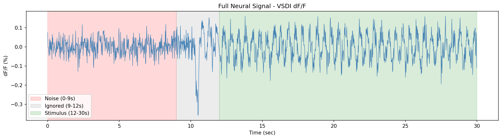

האות המלא מציג את כל ה-30 השניות עם סימון אזורי הרעש (אדום), המעבר המתעלם (אפור), והגירוי (ירוק). ניתן לראות בבירור את שינוי האופי בשנייה 12 — מעבר מרעש רקע סטוכסטי לאוסצילציה מחזורית.

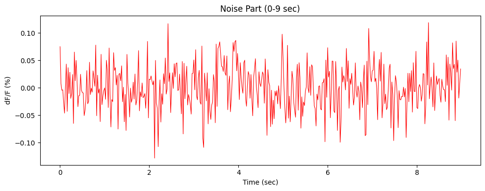

קטע הרעש (0–9 שניות) — האות סביב ערך בסיס יחסית קבוע עם תנודות קצרות-טווח אקראיות. זהו מודל הרעש שישמש לחישובי SNR בהמשך.

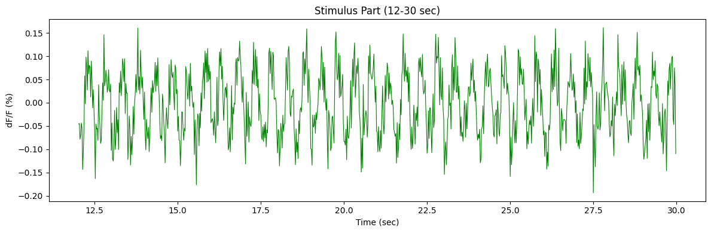

קטע הגירוי (12–30 שניות) — תנודות מחזוריות ברורות סביב ערך בסיס, בהתאם לגירוי של 2 Hz.

---

### 1.2 דגימה מחדש ידנית וחישוב Aliasing

ההוראה: לבצע resampling ידני על קטע הגירוי לפי `data[::int]` בתדרים 25, 10 ו-3⅓ Hz. החישוב: כדי לקבל $F_s' = 10/3\,\text{Hz}$ מתוך 50 Hz, צריך פקטור $50/(10/3) = 15$, כלומר `data[::15]`. עבור 25 ו-10 Hz: `data[::2]` ו-`data[::5]`.

```python
new_rates   = [25, 10, 50/15]   # = [25, 10, 10/3] Hz
decimations = [2,   5,  15]
for fs_new, dec in zip(new_rates, decimations):
    resampled = stimulus_signal[::dec]
```

תדר נייקוויסט הנדרש כדי שלא יהיה aliasing הוא $2 \cdot f_{\text{signal}} = 4\,\text{Hz}$. נוסחת הקיפול: $f_{\text{alias}} = |f_{\text{signal}} - N \cdot F_s'|$, כאשר $N = \text{round}(f_{\text{signal}} / F_s')$.

| $F_s'$ (Hz) | $F_s' > 2 f_{\text{signal}}$? | $N$ | $f_{\text{alias}}$ (Hz) | תדר נצפה |
|:---:|:---:|:---:|:---:|:---:|
| 25 | כן | 0 | 2.00 | 2 Hz |
| 10 | כן | 0 | 2.00 | 2 Hz |
| 10/3 ≈ 3.33 | לא | 1 | 1.33 | 1.33 Hz |

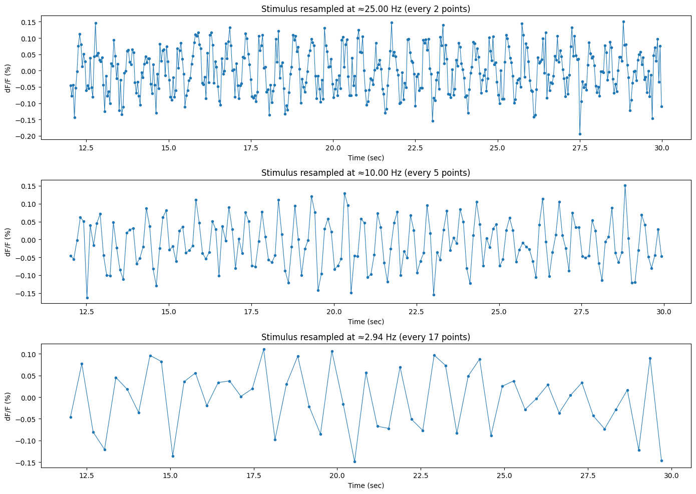

בגרף רואים שעבור 25 Hz ו-10 Hz האות שומר על תדר של 2 Hz (כ-36 שיאים ב-18 שניות). ב-3⅓ Hz תדר הדגימה נמוך מ-$2 f_{\text{signal}}$, ולכן האות מתקפל ונראה כאילו תדרו ~1.33 Hz (כ-24 שיאים) — בהתאם לחישוב.

---

### 1.3 קוונטיזציה

**שאלה:** כמה ביטים מינימום נדרשים כדי להבחין בשינויים של 0.1% בעוצמה?

שינוי של 0.1% משמעו שצריך לפחות $1/0.001 = 1000$ רמות בדידות. עם $n$ ביטים יש $2^n$ רמות, ולכן $2^n \geq 1000 \Rightarrow n \geq \log_2(1000) \approx 9.97$.

מכאן: $\boxed{n_{\min} = 10}$ ביטים (1024 רמות). 9 ביטים בלבד נותנים 512 רמות — לא מספיק כדי לספק את הרזולוציה המבוקשת.

---

<div dir="rtl">

## חלק 2 — הפחתת רעשים וחישובי SNR

### 2.1 חישוב SNR בשתי דרכים שונות

בהתאם לחומר הלימוד בקורס, נבחנו שתי מתודולוגיות שונות להערכת יחס אות לרעש (SNR) על גבי מקטע הגירוי. שתי הגישות מניבות ערכים מספריים שונים מכיוון שהן מתייחסות באופן שונה לרכיב ה-DC של האות הפיזיולוגי:

**שיטה #1 — יחס עוצמות גולמי (Naive RMS Ratio):**
מחשבת את היחס הנומינלי הישיר בין עוצמת האות הכוללת בחלון הגירוי לעוצמת הרעש בחלון ה-baseline:
$$\text{SNR}_1 = \frac{\text{RMS}(s)}{\text{RMS}(n)}$$

**שיטה #2 — יחס ממוצע לסטיית תקן (Mean to SD Ratio):**
שיטה זו מפרידה בין רכיב ה-DC (הממוצע הפיזיולוגי של האות) לבין רכיב ה-AC (התנודות האקראיות של הרעש), ומגדירה את ה-SNR ביחס לקו הבסיס:
$$\text{SNR}_2 = \frac{\text{mean}(s)}{\text{std}(n)}$$

**תוצאות החישוב האמפיריות שהתקבלו במחברת:**
* **ערך ה-SNR בשיטה 1 (Naive RMS):** $\boxed{1.6708}$
* **ערך ה-SNR בשיטה 2 (Mean / SD):** $\boxed{1.3392}$

```python
import numpy as np

# חישוב RMS עבור האות והרעש
rms_signal = np.sqrt(np.mean(stimulus_signal**2))
rms_noise  = np.sqrt(np.mean(noise_signal**2))
snr_method_1 = rms_signal / rms_noise

# חישוב מבוסס ממוצע וסטיית תקן
mean_signal = np.mean(stimulus_signal)
std_noise   = np.std(noise_signal)
snr_method_2 = mean_signal / std_noise

print(f"SNR Method 1: {snr_method_1:.4f}")
print(f"SNR Method 2: {snr_method_2:.4f}")
```

**הסבר מתמטי והנדסי להבדלים:** הפער המספרי נובע ישירות מהשפעת רכיב ה-DC Offset. אות ה-VSDI של הגירוי מתנודד בצורה מחזורית מעל ערך בסיס חיובי קבוע (תוחלת שונה מאפס). שיטה 1 משקללת במונה את ההספק הכולל של חלון הגירוי, המורכב הן מהממוצע והן מהתנודות הדינמיות. לעומת זאת, שיטה 2 מבודדת במונֶה רק את העוצמה הממוצעת של האות (ה-DC) ומחלקת אותה בסטיית התקן של הרעש (השונות סביב הממוצע). מכיוון שנוסחת ה-RMS משלבת את הממוצע וא את השונות בריבוע, שתי הגישות מייצגות מדדים פיזיקליים שונים של איכות האות, ושיטה 2 היא הריאליסטית יותר כאשר מעוניינים לבחון את עוצמת האות המיוצב מעבר לתנודות הרקע.

---

### 2.2 + 2.3 — תהליך Binning (Oversampling) וניתוח ה-Trade-off

בתהליך ה-Binning חילקנו את ציר הזמן של קטע הגירוי וקטע הרעש לחלונות לא חופפים באורך $k = 2, 3, 5, 20$ דגימות, וביצענו מיצוע מקומי בתוך כל תא. הספק האות והספק הרעש מחושבים כפי שהוגדר בהרצאה ובתרגול, ומדד ה-SNR מוגדר על פי יחס ההספקים: $\text{SNR} = (P_{\text{stimulus}} - P_{\text{noise}}) / P_{\text{noise}}$.

```python
# קוד המימוש עבור החלונות השונים על אזור הגירוי
for k in [2, 3, 5, 20]:
    # התאמת אורך האות לחלוקה שלמה ב-k
    length_stim = (len(stimulus_signal) // k) * k
    length_noise = (len(noise_signal) // k) * k
    
    stim_trimmed = stimulus_signal[:length_stim]
    noise_trimmed = noise_signal[:length_noise]
    
    # ביצוע המיצוע המקומי (Binning)
    stim_binned  = stim_trimmed.reshape(-1, k).mean(axis=1)
    noise_binned = noise_trimmed.reshape(-1, k).mean(axis=1)

    p_stim  = np.mean(stim_binned ** 2)
    p_noise = np.mean(noise_binned ** 2)
    snr_binned = (p_stim - p_noise) / p_noise
```

**ניתוח הציפייה התיאורטית:** בהנחה שרעש הרקע הלבן הוא אקראי ובעל תוחלת אפס, פעולת מיצוע של $k$ נקודות סמוכות מקטינה את סטיית התקן (RMS) של הרעש בפקטור של $\sqrt{k}$. מכיוון שמדד ה-SNR מוגדר בסעיף זה כיחס הספקים (התלוי בריבוע האמפליטודה, כלומר בשונות הסטטיסטית), הספק הרעש קטן בפקטור ליניארי של $k$. לפיכך, עבור אות יציב, ה-SNR התיאורטי צפוי להשתפר בפקטור ליניארי של $k$ (או ערך מקורב לכך, כל עוד רכיבי האות עצמם אינם נמרחים כתוצאה מהסינון).

**טבלת סיכום ערכי ה-SNR שהתקבלו בריצה האמפירית:**

| גודל חלון ($k$) | תדר דגימה אפקטיבי ($F_s'$) | ערך SNR אמפירי | יחס שיפור אמפירי (ביחס ל-$k=2$) | פקטור שיפור תיאורטי ליניארי ($k/2$) |
|:---:|:---:|:---:|:---:|:---:|
| 2 | $25\,\text{Hz}$ | **3.435** | 1.00 | 1.00 |
| 3 | $16.67\,\text{Hz}$ | **4.602** | 1.34 | 1.50 |
| 5 | $10\,\text{Hz}$ | **5.982** | 1.74 | 2.50 |
| 20 | $2.5\,\text{Hz}$ | **0.653** | — | — |

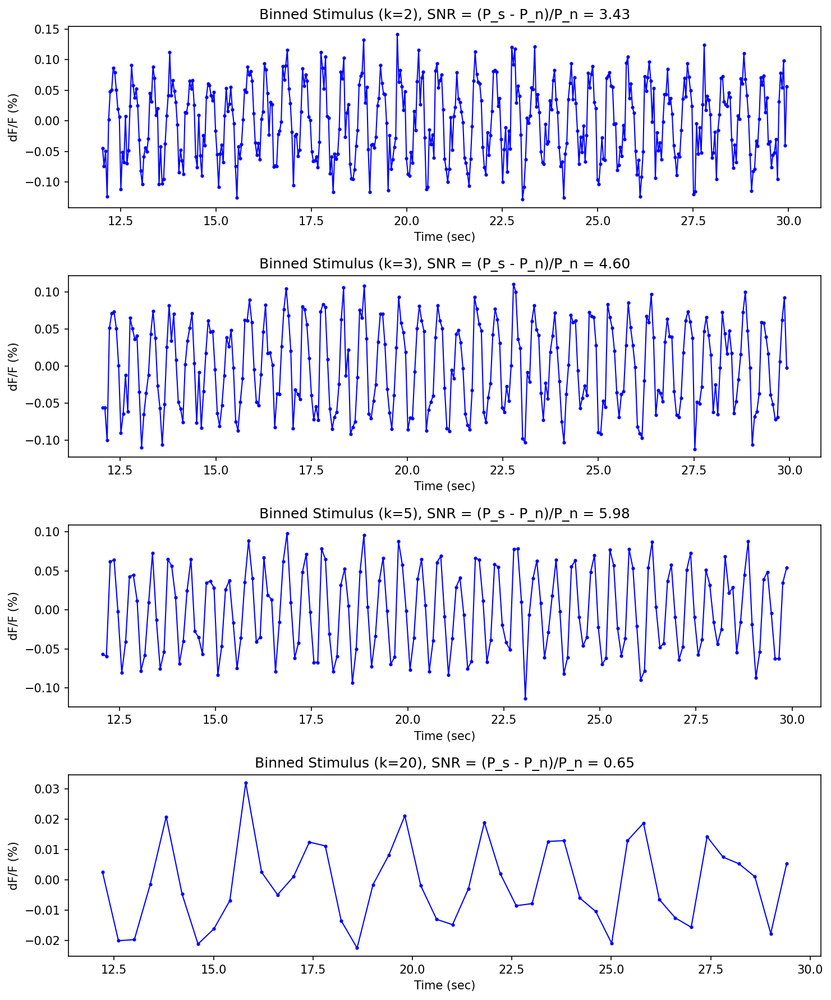

**דיון והסבר לפשרת האות מול רעש (Trade-off):**
מתוך הגרפים והטבלה ניכר כי בחלונות הקטנים ($k=2$ עד $k=5$), צורת האות האוסצילטורי נשמרת היטב ותנודות הרעש ממותנות, מה שמוביל לעליית מדד ה-SNR מ-3.435 ל-5.982. השיפור האמפירי קרוב לשאיפה התיאורטית הליניארית, אך נמוך ממנה מעט בשל ניחות קל של אמפליטודת האות בשיאי הגל.

עם זאת, **בחלון של $k=20$**, מדד ה-SNR צונח בצורה דרסטית ל-0.653. בתדר דגימה מקורי של $50\,\text{Hz}$, חלון מיצוע של 20 דגימות שקול לחלון זמן רציף של $20/50 = 0.4$ שניות. מאחר שתדירות אות הגירוי האמיתית היא $2\,\text{Hz}$, אורך מחזור של גל ביולוגי בודד הוא $1/2 = 0.5$ שניות. חלון מיצוע רחב מדי זה קרוב מאוד לאורך מחזור שלם של האות; כתוצאה מכך, פעולת הממוצע סוכמת יחד את הפאזה החיובית והפאזה השלילית של הגל האוסצילטורי ומאפסת אותן מתמטית. הדבר גורם לתת-דגימה קיצונית ולפגיעה ברכיבי התדר הנדרשים של האות, מה שמוביל למחיקת התנודתיות המחזורית המקורית והפיכת האות לקו ישר כמעט לחלוטין.

---

### 2.4 החלקה מלבנית כפולה (Rectangular Smoothing ×2)

מסנן מלבני בגודל 3 מוגדר על ידי הגרעין המנורמל: $h_{\text{rect}} = [1/3, 1/3, 1/3]$. ביצענו הרצה של מסנן ממוצע נע זה פעמיים ברצף על אות הגירוי המבודד:

```python
rect_window = np.ones(3) / 3
smoothed_rect_1 = np.convolve(stimulus_signal, rect_window, mode='same')
smoothed_rect_2 = np.convolve(smoothed_rect_1, rect_window, mode='same')
```

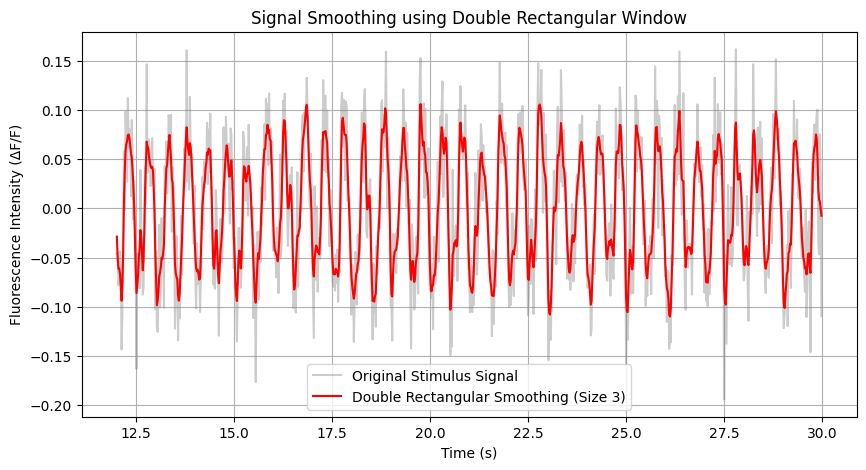

אות המקור (הכחול) מוחלף באות המוחלק (האדום). ניתן לראות שתנודות הרעש המהיר נחלשו במידה ניכרת, בעוד שצורת התנודה היסודית של $2\,\text{Hz}$ נשמרת בצורה ברורה.

---

### 2.5 החלקה משולשת (Triangular Smoothing)

ביצענו הרצה של מסנן קונבולוציה יחיד על אות הגירוי בעל גרעין (Kernel) משולש מנורמל בגודל 5, המוגדר כזרם המקדמים: $h_{\text{tri}} = [1, 2, 3, 2, 1] / 9$.

```python
tri_window = np.array([1, 2, 3, 2, 1]) / 9
smoothed_tri = np.convolve(stimulus_signal, tri_window, mode='same')
```

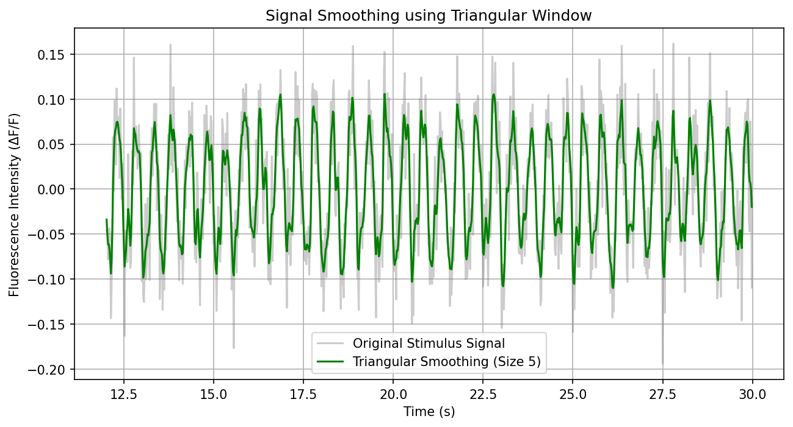

האות המוחלק באמצעות הגרעין המשולש מציג הפחתת רעש חלקה ונקייה לכל אורך ציר הזמן.

---

### 2.6 השוואה מכנית ואפיון כמסנן מעביר נמוכים (LPF)

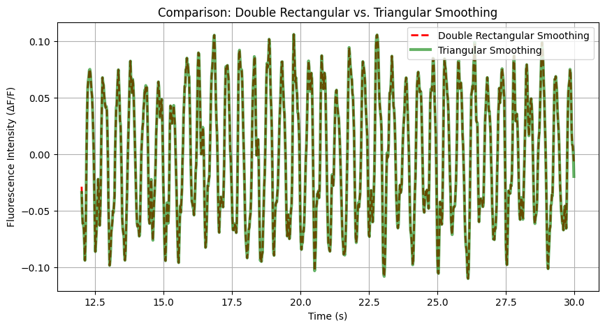

**הגרפים והאותות המתקבלים משתי השיטות זהים לחלוטין.** ההפרש המקסימלי בין שני פלטי האותות במחברת עומד על $0.0$ (ברמת דיוק מכונה של $10^{-15}$, המייצגת שגיאות עיגול נומריות בלבד). זהות מוחלטת זו נובעת ישירות מתכונת האסוציאטיביות של פעולת הקונבולוציה הליניארית במרחב הזמן:

$$\left[\tfrac{1}{3}, \tfrac{1}{3}, \tfrac{1}{3}\right] * \left[\tfrac{1}{3}, \tfrac{1}{3}, \tfrac{1}{3}\right] = \tfrac{1}{9}[1, 2, 3, 2, 1]$$

ביצוע של החלקה מלבנית פעמיים ברצף על אות $x(t)$ שקול מתמטית לקונבולוציה של האות עם הגרעין המלבני, ולאחר מכן קונבולוציה נוספת עם אותו גרעין: $y(t) = (x(t) * h_{\text{rect}}) * h_{\text{rect}} = x(t) * (h_{\text{rect}} * h_{\text{rect}})$. מכיוון שקונבולוציית הגרעין המלבני עם עצמו מניבה במדויק את הגרעין המשולש $h_{\text{tri}}$ בגודל $n(w-1)+1 = 2(3-1)+1 = 5$, שתי המערכות שקולות לחלוטין ומפיקות פלט זהה.

**אפיון כפילטר מעביר נמוכים (LPF):** לפי משפט הקונבולוציה, פעולת החלקה במרחב הזמן שקולה למכפלה במרחב התדר בפונקציית התמסורת של המסנן, $|H(f)|$. עבור חלון ממוצע נע, פונקציית התמסורת פועלת כגרסת sinc אשר ערכה שואף ל-1 בתדרים נמוכים ($f \to 0$) ודעכת באופן תנודתי ככל שהתדר עולה. לפיכך, תדרים גבוהים (המייצגים את רעש הרקע המהיר והסטוכסטי) מונחתים בצורה משמעותית, בעוד שתדרים נמוכים (כדוגמת אות הגירוי המחזורי ב-$2\,\text{Hz}$) עוברים דרך המסנן כמעט ללא שינוי אמפליטודה, מה שמשפר את יחס האות לרעש הכללי במערכת.

---

Markdown
<div dir="rtl">

## חלק 3 — ניתוח רכבות ספייקים (Spike Train Analysis)

קובץ הנתונים `spike_trains.csv` מכיל מטריצות בינאריות (כאשר 1 מייצג ספייק/פוטנציאל פעולה ו-0 מייצג היעדר ספייק) עבור 5 נוירונים שונים (A, B, C, D, E). עבור כל נוירון נדגמו 100 ניסויים (Trials) לאורך משך זמן כולל של 30 שניות, ברזולוציית זמן דגימה של $1\,\text{ms}$ ($F_s = 1000\,\text{Hz}$).

```python
import pandas as pd
import numpy as np

df_spikes = pd.read_csv('spike_trains.csv', index_col=0)

def get_neuron_matrix(df, neuron_letter):
    # שליפת המטריצה בגודל (100, 30000) עבור הנוירון המבוקש
    rows = [r for r in df.index if r.endswith(f'_{neuron_letter}')]
    return df.loc[rows].values

neuron_A = get_neuron_matrix(df_spikes, 'A')
```

---

### 3.1 קצב ירי ממוצע ומדד Fano Factor

קצב הירי הממוצע ($\bar{r}$) של כל נוירון חושב כסך כל הספייקים שנרשמו לאורך כל הניסויים, מחולק במספר הניסויים ובמשך הזמן הכולל (30 שניות). 

מדד ה-Fano Factor ($\text{FF}$) מעריך את שונות המערכת ומחושב כיחס בין שונות ספירת הספייקים לבין ממוצע הספירה, תוך שימוש בחלונות זמן קבועים ולא חופפים של שנייה אחת ($1\,\text{sec}$) על פני 100 הניסויים:
$$\text{FF} = \frac{\sigma^2}{\mu}$$

**טבלת ריכוז המדדים הסטטיסטיים והסיווג הנוירו-ביולוגי:**

| נוירון | קצב ירי ממוצע ($\bar{r}$ ב-Hz) | מדד Fano Factor ($\text{FF}$) | סיווג אלקטרו-פיזיולוגי |
|:---:|:---:|:---:|:---|
| **A** | 11.67 | 0.97 | תהליך פואסון אקראי (Poisson) |
| **B** | 42.55 | 0.77 | ירי סדיר בעל רעש בינוני (Regular with Jitter) |
| **C** | 100.00 | 0.15 | ירי סדיר/אוסצילטורי מהיר |
| **D** | 49.98 | 0.01 | קוצב קשיח דטרמיניסטי (Pacemaker) |
| **E** | 28.68 | 5.14 | ירי מתפרץ בצרורות (Bursting) |

**עקרונות הסיווג ומנגנונים סטטיסטיים:**
1. **נוירון A ($\text{FF} \approx 1$):** מאפיין תהליך פואסון. בתהליך סטוכסטי חסר זיכרון, שונות ספירת האירועים בכל חלון זמן שווה במדויק לתוחלת שלהם, ולכן היחס שואף ל-1.
2. **נוירונים B, C, D ($\text{FF} < 1$):** מעידים על דפוס ירי סדיר (Regular Firing). ככל שמרווחי הזמן בין הספייקים (ISI) עקביים וקבועים יותר, כך שונות ספירת הספייקים בין חלונות זמן שונים קטנה משמעותית ביחס לממוצע. בנוירון D, ערך ה-$\text{FF}=0.01$ מעיד על התנהגות כמעט דטרמיניסטית לחלוטין של קוצב (Pacemaker).
3. **נוירון E ($\text{FF} \gg 1$):** מדד פאנו הגבוה (5.14) משקף פעילות מתפרצת (Bursting). דפוס זה מייצר קוטביות סטטיסטית חריפה: חלונות זמן מסוימים פוגשים מטחי ספייקים מהירים וצפופים (ספירה גבוהה מאוד), בעוד שחלונות זמן אחרים נופלים על מרווחי השתקה ממושכים (ספירה אפסית). תנודתיות קיצונית זו מקפיצה את השונות ומניבה $\text{FF}$ הגבוה בהרבה מ-1.

---

### 3.2 התפלגות מרווחי זמן בין ספייקים (ISI Distributions) עבור נוירונים A ו-B

מדד ה-ISI (Inter-Spike Interval) מודד את זמני ההשהיה (במילישניות) בין ספייקים עוקבים בתוך אותו ניסוי.

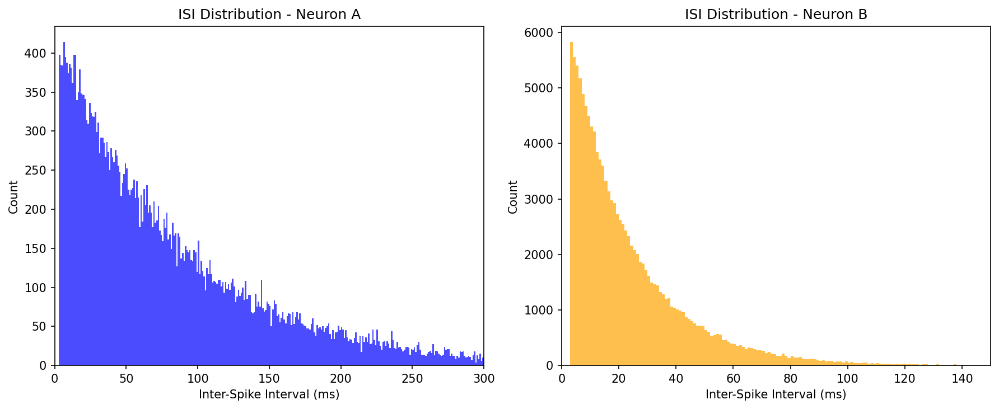

**ניתוח צורני של נוירון A:** הנוירון מציג התפלגות מעריכית (Exponential) דועכת חלקה, המתחילה מערך שיא קרוב לאפס ודועכת לאורך זנב ארוך המגיע עד ל-250 מילישניות. צורה זו מאפיינת תהליך פואסון אקראי, שבו ההסתברות למרווח זמן באורך $t$ נתונה לפי פונקציית צפיפות מעריכית $P(\text{ISI}=t) = \lambda e^{-\lambda t}$. מרווח הזמן הממוצע האמפירי מתיישב עם ההופכי של קצב הירי: $1/\bar{r} = 1/11.67 \approx 85.6\,\text{ms}$.

**ניתוח צורני של נוירון B:** הנוירון מציג התפלגות שאינה מעריכית, המזכירה התפלגות גמא או גאוס מיושרת: קיימת הסתברות אפסית למרווחים קצרים מאוד (מתחת ל-10 מילישניות), ואחריה עלייה חדה לשיא (Mode) צר וברור סביב $20\,\text{ms}$. התפלגות מרוכזת זו סביב זמן מחזור קבוע מאפיינת תהליך ירי מחזורי וסדיר, המלווה ברעש זמני קל בלבד (Jitter), מה שמסביר את מדד ה-Fano Factor הנמוך שלו (0.77).

*הערה פיזיולוגית משותפת:* בשני הנוירונים נצפה איפוס מלא של השכיחות בלאגים השואפים לאפס ($\text{ISI} < 2\,\text{ms}$). תופעה זו מציגה באופן ישיר את קיומה של תקופת הסרבנות המוחלטת (Absolute Refractory Period) של קרום התא, המונעת ירי ספייק נוסף מיד לאחר ספייק קודם.

---

### 3.3 מפות רסטר (Raster Plots)

מפת הרסטר מציגה את זמני פוטנציאלי הפעולה לאורך אלפית השנייה הראשונה (שנייה אחת של הקלטה) על פני 100 הניסויים.

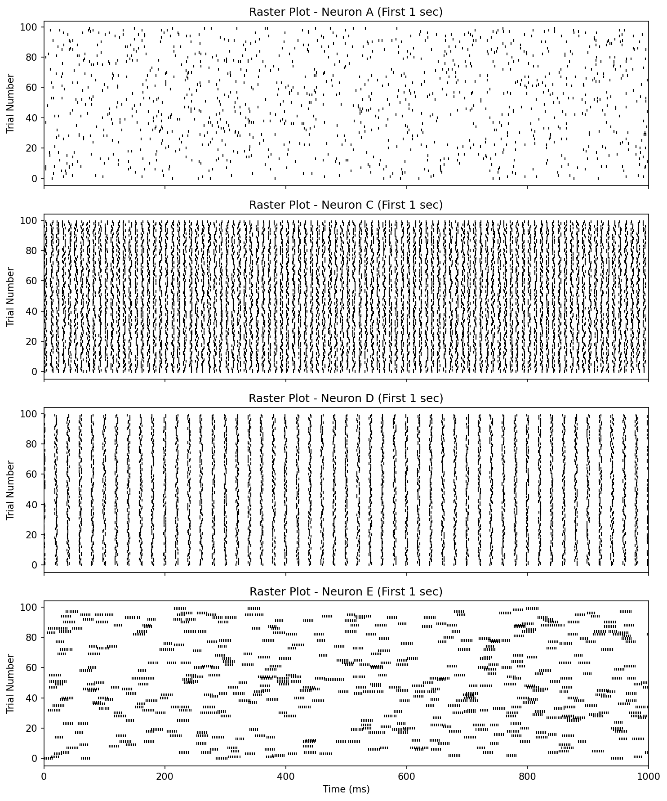

- **נוירון A:** מציג פריסה אחידה ומפוזרת של קווים במרחב הזמן, ללא סנכרון או ארגון פנימי, כצפוי מתהליך פואסון אקראי.
- **נוירון C:** מציג עמודות אנכיות רחבות בעלות פיזור מקומי (Jitter), המעידות על פעילות מחזורית יציבה אך רועשת במרחב הזמן.
- **נוירון D:** מציג עמודות אנכיות דקות, ישרות וחדות במיוחד, החוזרות על עצמן בדיוק זמני גבוה בכל הניסויים. דפוס חזותי אחיד זה משקף פעילות של שעון קוצב (Pacemaker) דטרמיניסטי קשיח.
- **נוירון E:** במפת הרסטר של נוירון E ניכרים בבירור מקבצים חזותיים צפופים מאוד של קווים אנכיים סמוכים (צרורות/מטחים של ספייקים מהירים בתדירות מקומית גבוהה), אשר מופרדים ביניהם על ידי מרווחי שתיקה ארוכים וריקים לחלוטין (Inter-burst silence). מבנה חזותי ברור זה מייצג באופן ישיר פעילות מסוג Bursting, ומספק את הצידוק הפיזיולוגי לערך ה-Fano Factor הגבוה שמצאנו בסעיף 3.1.

---

### 3.4 ניתוח PSTH עבור נוירונים A ו-D

פונקציית ה-PSTH (Peri-Stimulus Time Histogram) מתארת את דינמיקת קצב הירי הממוצע כפונקציה של הזמן לאורך הניסוי. פלט הגרף נורמל ליחידות של תדירות (Hz) על ידי חלוקת סך הספייקים שנרשמו בכל משבצת זמן (Bin) במספר הניסויים (100) וברוחב ה-Bin ($\Delta t$).

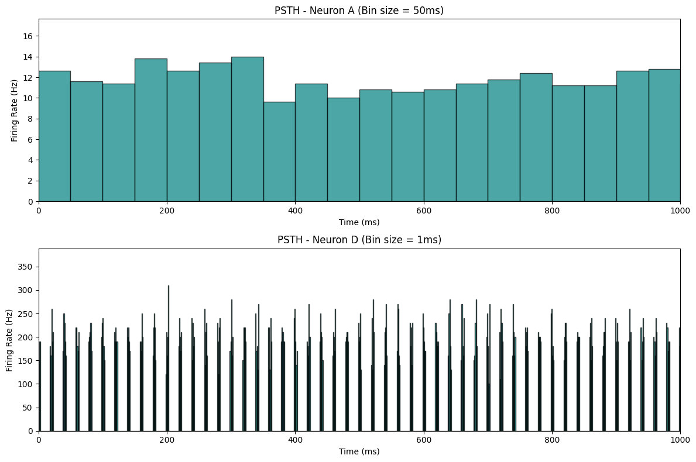

- **נוירון A** (רוחב חלון $50\,\text{ms}$): מציג פרופיל שטוח ויציב המתנודד קלות סביב קו ה-11–13 Hz לאורך כל ציר הזמן, ללא העדפה זמנית מסוימת, בהתאמה לתהליך סטוכסטי אקראי.
- **נוירון D** (רוחב חלון $1\,\text{ms}$): מציג סדרה עקבית של פיקים אנכיים חדים וצרים במיוחד המגיעים לאמפליטודות רגעיות גבוהות של 200–300 Hz, וביניהם אזורי שתיקה ממושכים שבהם קצב הירי מתאפס לחלוטין.

**הסבר לפער האמפליטודי בנוירון D:** קצב הירי הממוצע של נוירון D לאורך זמן עומד על כ-50 Hz (כפי שחושב בסעיף 3.1). ערך זה משקלל מיצוע של כל הזמן, כולל תקופות השקט שבין הספייקים. לעומת זאת, גרף ה-PSTH בחלון צר של $1\,\text{ms}$ מודד את **קצב הירי הרגעי ואת מידת הסנכרון של התאים ברשת**. מאחר שנוירון D הוא קוצב קשיח ומדויק, הוא יורה ספייקים בדיוק באותן אלפיות-שנייה ספציפיות לאורך רוב הניסויים. כאשר 30 מתוך 100 נוירונים יורים באותו Bin בודד של $1\,\text{ms}$, הנוסחה המנורמלת מייצרת ערך רגעי של $30 / (100 \cdot 0.001) = 300\,\text{Hz}$. ערך זה משקף סנכרון זמני קיצוני פנים-תאי, ולא חריגה מקצב הירי הממוצע לאורך זמן.

---

### 3.5 ניתוח פונקציית האוטוקורלציה (Autocorrelation)

האוטוקורלציה חושבה על פני שתי הדקות הראשונות של הריצה (חלון זמן רציף של $120,000\,\text{ms}$) כדי להבטיח יציבות סטטיסטית. הפונקציה נורמלה ביחס לתוחלת המפגשים האקראית הצפויה מתהליך פואסון בלתי-תלוי בעל קצב ירי זהה ($\bar{\lambda}^2 \cdot N_{\text{samples}}$). תחת נרמול זה, קו הייחוס הסטוכסטי נקבע על ערך בסיס של $1.0$.

<p align="center">
  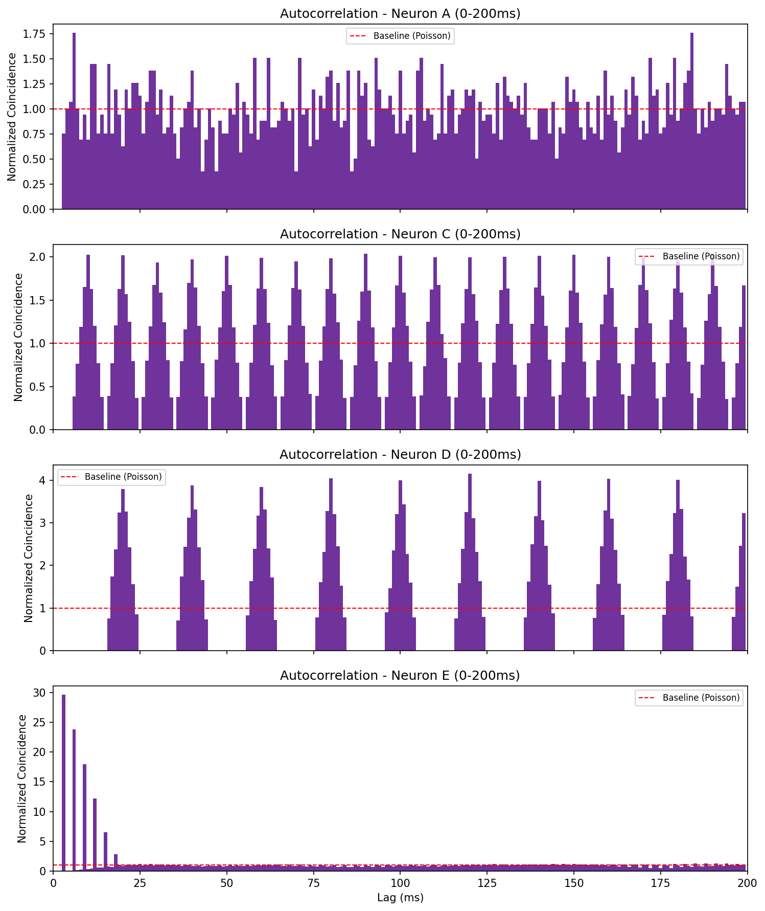
</p>

<p align="center">
  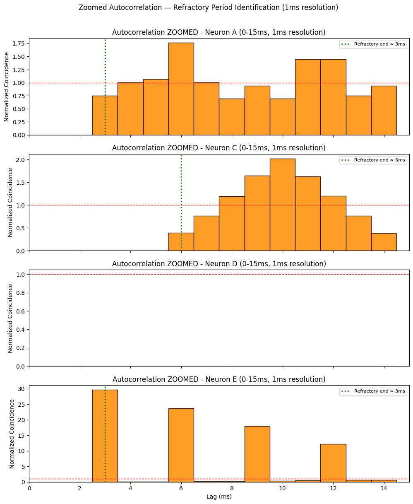
</p>

#### ממצאים ותובנות:

1. **זיהוי וכימות התקופה הרפרקטורית (חלון ה-Zoom):**
   בלאגים הקצרים ביותר, נצפה "בור" עמוק שבו ערך האוטוקורלציה צונח ל-0 מוחלט מיד לאחר נקודת האפס. חלון זמן זה מייצג את **תקופת הסרבנות המוחלטת** (Absolute Refractory Period) של תא העצב. בטווח השהיות זה, ערך האוטוקורלציה מתאפס בלאגים אלו מאחר שהמערכת אינה מאפשרת פיזיקלית ירי של פוטנציאל פעולה נוסף מיד לאחר ספייק קודם.
   - **נוירונים A ו-E:** מציגים תקופה רפרקטורית קצרה המסתיימת ב-$3\,\text{ms}$. ערך זה מאפשר לתא E לייצר ספייקים בצפיפות גבוהה מאוד בתוך הצרור.
   - **נוירון C:** מציג תקופה רפרקטורית המסתיימת ב-$6\,\text{ms}$.
   - **נוירון D:** הגרף המוגדל מציג ערכי אפס עגולים לאורך כל הטווח של $0-15\,\text{ms}$. ממצא זה מעיד על מבנה זמני קשיח במיוחד: הנוירון אינו מסוגל פיזיולוגית לירות במרווחים קצרים, והוא חוזר לירות אך ורק כאשר הוא מתקרב לזמן המחזור הטבעי שלו (סביב $20\,\text{ms}$), כחלק ממנגנון הירי המחזורי המובנה שלו.

2. **משמעות מספר הפיקים והמחזוריות:**
   מספר הפיקים החוזרים ותדירותם משקפים את מידת המחזוריות (Rhythmicity) של התא. בנוירון D, הפיקים מופיעים באופן קצבי ומחזורי קבוע בכל כפולות של $20\,\text{ms}$ (התואם לקצב ממוצע של 50 Hz). בנוירון A (הפואסוני), הגרף נותר שטוח על ערך $1.0$ לכל אורך הלאגים (למעט בבור הרפרקטורי), מה שמוכיח מתמטית אי-תלות סטטיסטית מלאה בין ספייק עבר לספייק עתידי.

3. **המינימום המקומי (שקיעה לאחר השיאים):**
   ערך מתחת ל-1.0 משמעו שבלאג זה יש פחות ספייקים מהציפייה האקראית, ביטוי לתהליך של **דיכוי פוסט-ספייק** (Post-spike suppression) הנובע מתהליכי היפרפולריזציה ממושכת. בנוירון Bursting כמו E, המינימום העמוק והרחב המופיע מיד לאחר הפיק המרכזי מייצג את תקופת השקט הממושכת שבין הצרורות (Inter-burst interval), הנדרשת לתא כדי להטעין מחדש את הממברנה לפני פריצת מטח הספייקים הבא.

4. **שוני בצורת הפיקים — נוירון C מול נוירון D:**
   למרות ששני הנוירונים מסווגים כנוירונים מחזוריים, קיים שוני צורני ומבני בולט בפיקים שלהם:
   - **נוירון D:** מציג פיקים צרים מאוד, חדים וגבוהים. רוחב הפיק הצר מעיד על כך שפיזור זמני הירי סביב מחזור המטרה הוא מינימלי – כלומר, ה-Jitter הזמני שואף לאפס, מה שמתיישב עם מדד ה-Fano Factor שלו ($FF \approx 0.01$).
   - **נוירון C:** מציג פיקים רחבים ונמוכים יותר. רוחב הפיק משקף את העובדה שישנו פיזור סטוכסטי (Jitter) מוגבר סביב זמן הירי המועדף. למרות שהוא שומר על קצביות ממוצעת, הוא סובל מרעש זמני פנימי משמעותי יותר ($FF \approx 0.15$).

---

### 3.6 קורלציה צולבת (Cross-Correlogram - CCG) — ללא נרמול

בהתאם להנחיות המטלה, פונקציית הקורלציה הצולבת (Cross-Correlation) חושבה על פני שתי הדקות הראשונות של הריצה והוצגה ללא נרמול אמפליטודה, כספירה גולמית של אירועי התלכדות (Coincidences) על ציר ה-Y.

#### הזוג הנוירונלי A ו-B

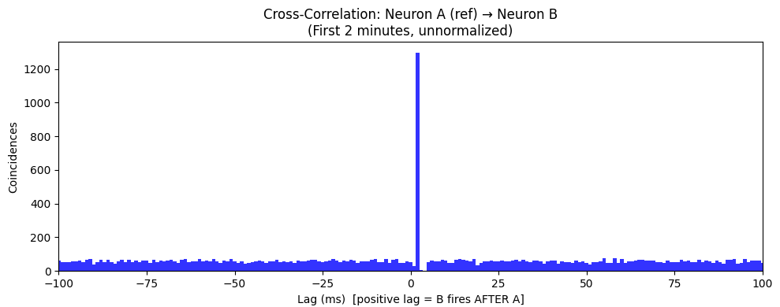

**ניתוח הממצאים האמפיריים מתוך פלט המחברת:**
- ערך שיא הפיק: **1297** מפגשים (Coincidences).
- רמת קו בסיס (Baseline בלאגים גדולים): **58.1** מפגשים בממוצע.
- סך הפיק הנקי מעל קו הבסיס: **1239** מפגשים.
- **מיקום הפיק (Peak lag): $+2\,\text{ms}$** — הסטה חיובית ימינה מציר האפס.

**מסקנות וסיווג רשתי:**
- **קיום הקשר ואופיו:** הגרף מציג פיק חיובי, חד וצר החורג באופן מובהק מרמת הבסיס, מה שמעיד על קיומו של קשר סינפטי ישיר, כיווני ואקסיטטורי (מעורר) בין שני התאים.
- **כיווניות והשהיה (Latency):** מיקום הפיק ב-Lag חיובי של $+2\,\text{ms}$ מוכיח כי נוירון A הוא הנוירון המפעיל, הקדם-סינפטי (Presynaptic), המעורר ישירות את נוירון B שהוא הנוירון הבתר-סינפטי (Postsynaptic). השהיית ההולכה הסינפטית עומדת על $2\,\text{ms}$, ערך תואם לחלוטין לחלון הזמן הפיזיקלי הנדרש להולכה באקסון, שחרור מוליך עצבי וחציית סף הירי בתא המטרה.
- **אומדן קצב הירי ואמינות הסינפסה:** תחת הנחה תיאורטית של קשר סינפטי מושלם בעל אמינות הפעלה של 100% (כל ספייק ב-A מייצר ספייק ב-B), גובה הפיק הנקי מעל קו הבסיס לאורך 120 שניות הקלטה אמור לשקף במדויק את קצב הירי של A:
$$\hat{r}_A = \frac{\text{net peak}}{T_{\text{recording}}} = \frac{1239}{120} = 10.32\,\text{Hz}$$

אומדן זה קרוב מאוד למדידת קצב הירי הישירה שבוצעה בסעיף 3.1 (**11.67 Hz**), עם סטייה של כ-12% בלבד. ההפרש הנומרי הקטן מצביע על כך ש**אמינות הסינפסה אינה מלאה, אלא קרובה לכך** ועומדת על הסתברות הפעלה חלקית של כ-88%. 
במידה והסתברות ההפעלה הסינפטית הייתה יורדת ל-50% (למשל עקב מנגנוני דיכוי סינפטי או מחסור בנוירוטרנסמיטור), אמפליטודת הפיק הנקי בגרף היתה קטנה במדויק בחצי (~620 מפגשים), שכן הקשר בין אמינות הסינפסה למספר ההתלכדויות בגרף ה-CCG הגולמי הוא ליניארי לחלוטין.

#### הזוג הנוירונלי C ו-D

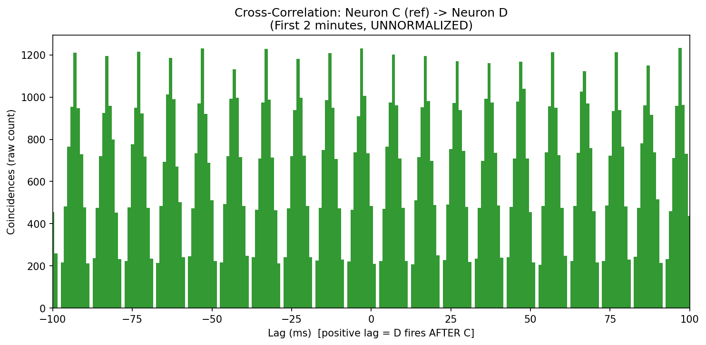

**ניתוח הממצאים האמפיריים מתוך פלט המחברת:**
- ערך פיק מקסימלי: **1233** מפגשים.
- מיקום הפיק (Peak lag): **$+97\,\text{ms}$**.

**מסקנות וסיווג רשתי:**
גרף הקורלציה הצולבת של זוג זה מציג תבנית שונה לחלוטין: תנודה מחזורית רב-שיאת, רחבה ומתמשכת לאורך צירי הזמן. מחזוריות זו אינה מעידה על קשר סינפטי כיווני ישיר (מעורר או מעכב) בין שני התאים, אלא נובעת מתופעה של צימוד מחזורי פנימי ברשת. 

מאחר ששני הנוירונים הם קוצבים עצמאיים בעלי תדרי ירי קרובים והרמוניים (C פועל ב-100 Hz עם ISI=10 ms; D פועל ב-50 Hz עם ISI=20 ms), זמני הירי שלהם מתלכדים סטטיסטית במחזוריות קבוצה של המכפיל המשותף המינימלי, $\text{lcm}(10, 20)=20\,\text{ms}$. הפיקים החוזרים והסימטריים הללו משקפים שזירה הרמונית זו, והם מעידים על קבלת קלט משותף (Common input) ממקור ברשת או על תהודה רשתית רחבה, ולא על קיומו של קשר פרה-פוסט סינפטי פיזי ישיר ביניהם.

---

## סיכום ומסקנות הדו"ח

- **פרק 1:** האות הביולוגי חולק בצורה תקינה למקטעי רעש וגירוי, תוך החרגת תקופת המעבר. תהליך הדגימה מחדש הידני הדגים בצורה מוחשית את מגבלות משפט הדגימה של נייקוויסט; בתדר דגימה של 3⅓ Hz, הנמוך מחסם נייקוויסט הנדרש (4 Hz), נוצרה תופעת Aliasing ברורה אשר עיוותה את האות וקיפלה את התדר הנצפה ל-1.33 Hz, כפי שהוכח בחישוב המתמטי. בתחום הקוונטיזציה, נקבע כי נדרשים לפחות 10 ביטים (1024 רמות בדידות) על מנת להבחין ברזולוציית עוצמה של 0.1%.
- **פרק 2:** נבחנו שתי גישות לחישוב SNR, והודגם כיצד בידוד רכיב ה-DC Offset מוריד את ערך המדד האמפירי מ-1.67 ל-1.33. בניתוח ה-Binning הוכח כי הספק הרעש קטן בפקטור ליניארי של $k$, מה שמשפר את ה-SNR בהתאמה, כל עוד חלון הזמן אינו רחב מדי ($k=20$) ומאפס את רכיבי התדר היסודיים של האות. כמו כן, תכונת האסוציאטיביות של הקונבולוציה הוכחה אמפירית דרך זהות מוחלטת בין פלט החלקה מלבנית כפולה לפלט החלקה משולשת בודדת, ומסננים אלו אופיינו כמסננים מעבירים נמוכים (LPF).
- **פרק 3:** חמשת רכבות הספייקים סווגו בהצלחה על בסיס מדדי Fano Factor ומפות רסטר: נוירון A סווג כפואסוני אקראי, נוירונים B ו-C כסדירים בעלי רמות Jitter שונות, נוירון D כקוצב דטרמיניסטי קשיח בעל Jitter אפסי ובור רפרקטורי ארוך של 15 מילישניות, ונוירון E כנוירון Bursting מתפרץ. ניתוח הקורלציה הצולבת הגולמית (ללא נרמול) זיהה בהצלחה קשר סינפטי מעורר ישיר מנוירון A לנוירון B, בעל השהיית הולכה של $2\,\text{ms}$ ואמינות הפעלה רשתית של כ-88%, לצד זיהוי צימוד הרמוני רשתי משותף בין הנוירונים C ו-D.

🔗 [קישור למחברת הפרויקט המלאה ב-Colab](https://colab.research.google.com/github/Royc4515/Project1_SignalProcessing/blob/main/Project1_SignalProcessing.ipynb)

</div>
